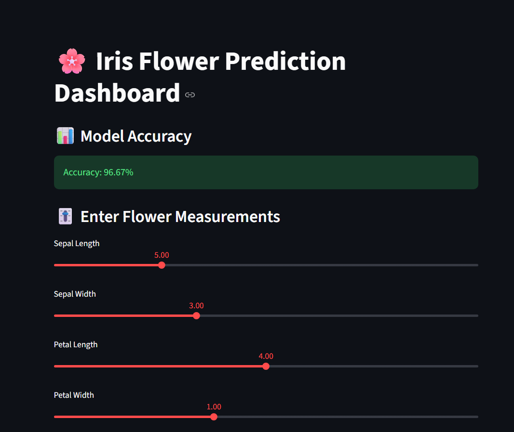
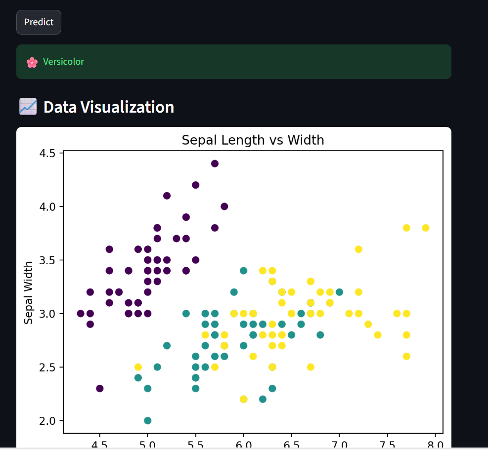
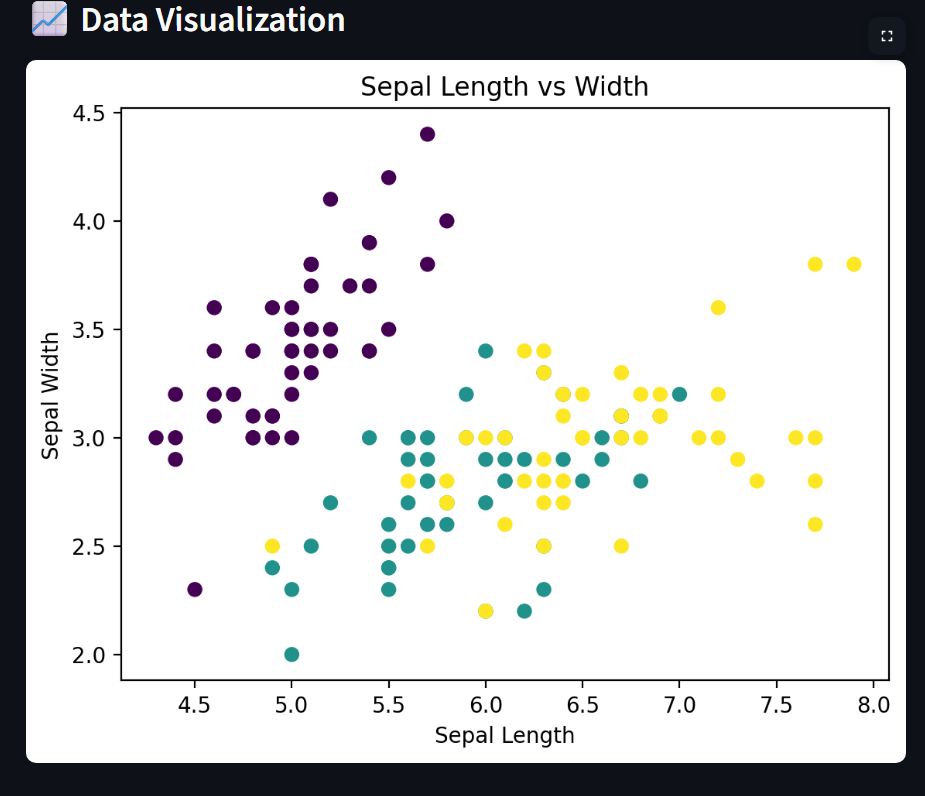
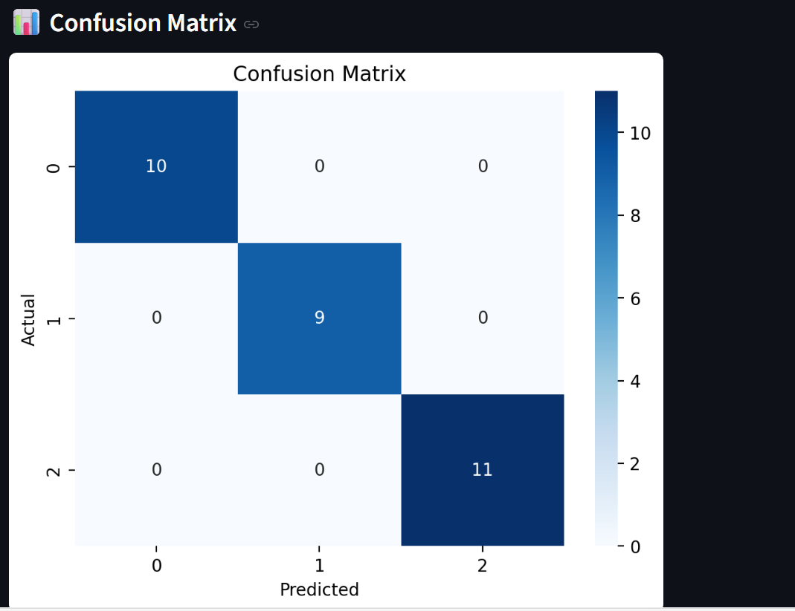
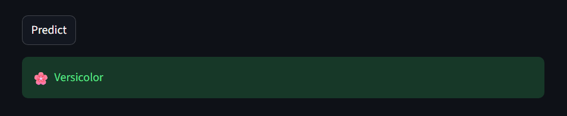
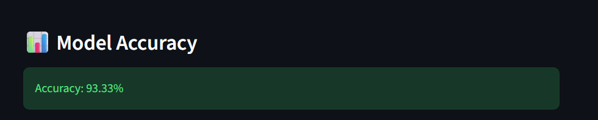

# 🌸 Iris Flower Prediction App

A Machine Learning web application built using Streamlit to predict the species of an iris flower based on user input.

---------------------------------------------------------------------------
## By: Aswath Shri Ram S.B

## 📌 Overview

This project uses a Logistic Regression model trained on the Iris dataset to classify flowers into:

- Setosa
- Versicolor
- Virginica

Users can input flower measurements and get instant predictions through an interactive web interface.

--------------------------------------------------------------------------

## ⚙️ Tech Stack

- Python
- Pandas
- NumPy
- Scikit-learn
- Streamlit
- Matplotlib
- Seaborn

--------------------------------------------------------------------------

## 📊 Dataset

The Iris dataset contains:

- Sepal Length
- Sepal Width
- Petal Length
- Petal Width

Target:
- Flower Species

-------------------------------------------------------------------------

## 🚀 Features

- Interactive Streamlit dashboard
- Real-time prediction
- Logistic Regression model
- Confusion Matrix visualization

--------------------------------------------------------------------------

### 🖥️ Dashboard UI

----------------------------------------------------------------------------

## 📈 Confusion Matrix

The confusion matrix is used to evaluate model performance.

- Diagonal values → Correct predictions
- Off-diagonal values → Incorrect predictions

-----------------------------------------------------------------------------
### 🎯 Prediction Output

-------------------------------------------------------------------------------
### 📊 Accuracy

--------------------------------------------------------------------------------
## 🧠 Model

- Algorithm: Logistic Regression
- Type: Classification
- High accuracy on test data
-------------------------------------------------------------------------------

## ▶️ How to Run

1. Install dependencies:

py -m pip install pandas numpy scikit-learn streamlit matplotlib seaborn

2. Run the app:

streamlit run app.py

-------------------------------------------------------------------------------

## 📌 Example Output

🌸 Predicted Species: Versicolor

-------------------------------------------------------------------------------

## 📄 Project Report

Download the full project report here:

[Download Report](./Iris_Project_Report.pdf)

-------------------------------------------------------------------------------
## 📎 Future Improvements

- Add more ML models
- Improve UI design
- Deploy the app online
- Add more visualizations

-------------------------------------------------------------------------------
